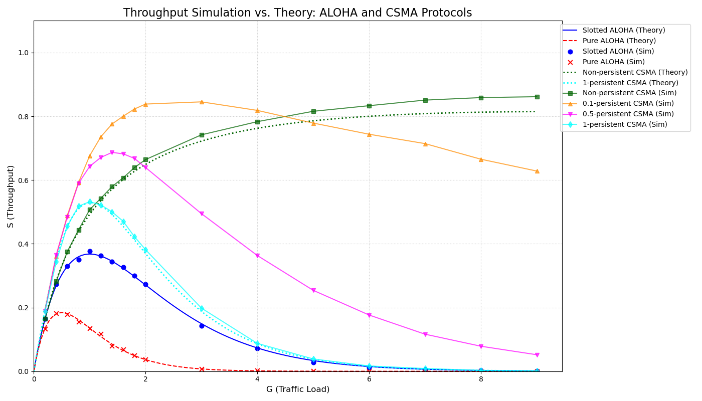

# [2023066980, Youngjin Kim(김영진)] HW2 Wireless Networks

## Overview
This project presents a discrete-time simulator implemented in C to analyze and compare the performance of Medium Access Control (MAC) protocols, specifically the **ALOHA** family (Pure ALOHA, Slotted ALOHA) and the **CSMA** family (Non-persistent, 1-persistent, p-persistent).

The simulation evaluates system throughput ($S$) against a wide range of offered traffic loads ($G$). The simulation results are exported as data files, which are subsequently used by a Python script to plot and compare empirical experimental data with analytical theoretical performance curves.



---

## Key Features
* **Integrated Simulator:** A single core C program (`channel_sim.c`) handles both the ALOHA and CSMA protocol suites.
* **Comprehensive CSMA Variant Support:** Supports Non-persistent, 1-persistent, and p-persistent (0.1 and 0.5) CSMA modes through macro and type configurations.
* **Theoretical Validation:** The Python visualization tool automatically overlays analytical theoretical equations onto the empirical simulation results for direct comparison.

---

## Directory Structure

```text
.
├── cashe
│   └── channel_sim          <--- Compiled binary executable
├── results
│   ├── channel_sim_results.dat      <--- Simulation result data used for plotting
│   └── protocol_throughput_plot.png <--- Final comparative throughput plot
├── Makefile
├── README.md
├── report.pdf               <--- copy of 'README.md' (pdf format)
└── src
    ├── channel_sim.c        <--- Main C simulator source code
    └── plot.py              <--- Python script for visualization and theoretical mapping
4 directories, 5 files

```

---

## System Parameters (Macro Definitions)

The primary environmental variables configured via macros and constants within `channel_sim.c` are defined as follows:

| Parameter | Default Value | Description |
| --- | --- | --- |
| `NUM_STATIONS` | 300 | Total number of network stations (nodes) competing for the shared channel. |
| `SLOT_SIZE_MS` | 10 | Duration of a single time slot in milliseconds (ms). |
| `SIMULATION_SLOTS` | 10000 | Total number of slots simulated to achieve statistical stability. |
| `NUM_G_VALUES` | 17 | Total number of evaluated traffic load ($G$) data points. |
| `G_VALUES` | 0.2 ~ 9.0 | Array of specific traffic loads ($G$) tested during execution. |

---

## Code Structure and Functions

### 1. Key Components

* `src/channel_sim.c`: Handles packet arrival generation, channel state verification, collision resolution, and persistence logic, and logs the raw results.
* `src/plot.py`: Reads the `.dat` file into a pandas DataFrame, computes theoretical limits, maps simulation markers, and outputs the final visual analysis using matplotlib.

### 2. Detailed Function Specifications

| Function Name | Category | Core Role |
| --- | --- | --- |
| `malloc_channel` | ALOHA | Allocates a dynamic array representing the timeline of channel ticks (tics) and initializes them to `FREE`. |
| `free_channel` | ALOHA | Safely deallocates the dynamically allocated memory for the channel tick array. |
| `rand_gen` | Common | Generates a pseudo-random floating-point number to determine packet arrival based on probability $p$. |
| `sim_1tic` | ALOHA | Simulates a single tick by sampling arrivals from all stations and evaluating whether the channel state becomes `FREE`, `FULL`, or `FAIL`. |
| `success_rate` | ALOHA | Drives the main loop for Slotted and Pure ALOHA simulations, tracking active transmission windows to calculate throughput. |
| `simulate_csma` | CSMA | Implements the carrier-sensing mechanism and handles Non-persistent, 1-persistent, and p-persistent state loops on the timeline. |
| `save_log_file` | Common | Exports the structured final numerical data to `results/channel_sim_results.dat`. |

---

## Protocol Operation and Algorithms

###  ALOHA Protocols

The ALOHA simulation varies the time granularity (`tic_per_slot`) inside `success_rate()` to mimic structural constraints.

* **Major Parameters**
* **G (or ch_info.p):** The system-wide total offered load `G`, and the probability `p` for each station to generate a packet at every tick based on it. The per-node generation probability is determined inversely proportional to the number of stations and ticks per slot.
* **success:** The total number of packets successfully transmitted without collision. If a new packet arrives during an ongoing transmission and causes a collision, it is validated by decrementing the previously incremented success counter (`success--`).
* **using:** A down-counter indicating the remaining transmission time (number of ticks) for the packet currently occupying the channel. It is initialized to `tic_per_slot - 1` when a packet transmission begins and decrements by 1 each tick, maintaining the channel occupancy until it reaches 0.
* **score:** A status flag (boolean state) indicating whether the packet currently being transmitted is proceeding normally without collision. It starts at `1` if it is the sole transmission at initiation, but switches to `0` if another transmission request occurs before the packet finishes, indicating a collision.
* **channel (or tmp/ChannelState):** The instantaneous state of the channel determined by aggregating the transmission requests (`req`) from stations at each tick. It maps to `FREE` if there are no requests, `FULL` if there is exactly 1, and `FAIL` if 2 or more requests occur, representing a discrete collision.


#### **Slotted ALOHA (`tic_per_slot = 1`)**
* Slotted ALOHA is implemented by fixing the number of ticks per slot to 1.
* If exactly one station transmits in a given slot, it is recorded as `FULL` (success). If two or more stations transmit, a collision (`FAIL`) occurs immediately.


#### **Pure ALOHA (`tic_per_slot = 100`)**
* Pure ALOHA is implemented by fixing the number of ticks per slot to 100. As `tic_per_slot` increases, discrete error decreases.
* If another transmission begins while an active transmission is in progress, all packets overlapping with the current transmission are canceled, simulating an in-transit collision.


###  CSMA (Carrier Sense Multiple Access) Protocols

The `simulate_csma()` function simulates carrier-sensing terminals. Each tick infers whether the medium is currently busy by inspecting a historical window (`tx_starts`).

#### **Major Parameters**
* **tx_starts:** An array memory space that records the number of nodes that started transmission at each tick. It serves as a history window to determine whether the channel is busy by checking if any node started transmission within the past packet transmission time (`tic_per_slot`) relative to a specific tick.
* **deferred_queue:** The cumulative number of nodes that generated packets when the channel was busy, failing to start transmission immediately, and deferring their transmissions until the channel becomes idle. (Used in 1-Persistent and p-Persistent modes).
* **success_count:** The total number of packets successfully transmitted without collision throughout the entire simulation period. The value increases only when exactly one node starts transmission at a specific tick (`tx_starts[i] == 1`), which is deemed a successful transmission.
* **p_persist:** The probability that a node transmits a packet when the channel is idle in p-Persistent CSMA. In the code, it is set to 0.1, 0.5, or 1.0 (for 1-Persistent) depending on the protocol type.
* **available_nodes:** The total number of nodes eligible to compete for transmission in the current tick when the channel transitions from busy to idle. It is calculated as the sum of newly arrived traffic (`new_arrivals`) and previously deferred traffic (`deferred_queue`).
* **transmitting:** The final number of nodes among the `available_nodes` that actually initiate transmission in the current tick by passing the probabilistic check based on the persistence probability (`p_persist`).


#### **Non-Persistent CSMA**
* When the channel is sensed as idle (`!busy`), the station transmits immediately.
* When the channel is sensed as busy, the station immediately aborts the attempt and backs off. It is not added to a queue to transmit immediately when the channel clears.
* A slight discrepancy from the theoretical values can be observed. This is presumed to be a discrete error due to setting `tic_per_slot=100`.


#### **1-Persistent CSMA**
* When the channel is idle, the station transmits immediately.
* When the channel is busy, the station continuously listens to the medium and defers traffic in the `deferred_queue`.
* The moment the channel transitions to idle, all waiting stations attempt to transmit with a probability of 1.0. Consequently, under high load conditions, an inherently high collision spike occurs right after a busy period.


#### **p-Persistent CSMA (0.1 and 0.5)**
* When the channel is busy, stations track it and accumulate in the `deferred_queue`.
* When the channel becomes idle, the accumulated and new arrivals attempt to transmit with the configured fractional probability $p_{\text{persist}}$ (e.g., 0.1 or 0.5).
* Nodes that fail the probabilistic check defer their attempts to the next tick, mitigating the collision spike following a busy state.


---

## Build and Execution

Project compilation and lifecycle are managed via the `Makefile`.

### Linux

```bash
make

```

This command compiles the C source code into `cashe/channel_sim`, runs the binary to output raw data, executes `plot.py` to process the results, and organizes everything into the `results/` folder.

### Windows

```cmd
mkdir cashe results
gcc src/channel_sim.c -o cashe/channel_sim.exe -lm -DNUM_STATIONS=300 -DSLOT_SIZE_MS=10 -DSIMULATION_SLOTS=10000 -DNUM_G_VALUES=17
.\cashe\channel_sim.exe
python src/plot.py
move channel_sim_results.dat results\
move protocol_throughput_plot.png results\

```
